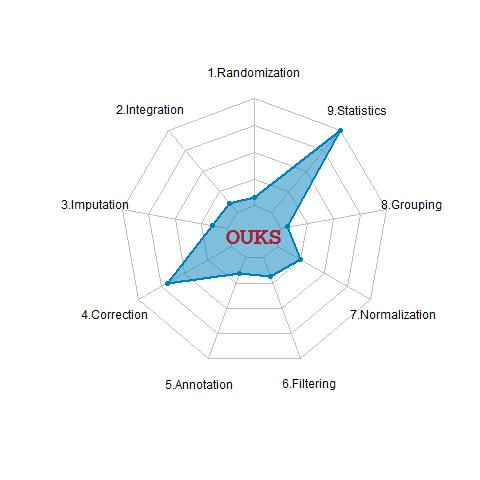

# OUKS  
R based open-source collection of scripts called *OUKS* (*Omics Untargeted Key Script*) providing comprehensive nine step LC-MS untargeted metabolomic profiling data processing:

1. experimental design and sample randomization;
2. peaks integration and time alignment; 
3. missing value imputation (MVI) and artifacts removal;
4. signal drift correction and batch effect removal;
5. feature annotation and tentative identification by database search; 
6. peaks filtering for quality checking and accounting of technical variation;
7. data normalization and adjusting of biological variation;
8. peaks grouping and molecular features clustering;
9. statistical analysis and hypothesis testing.

- Instruction and introduction into the *OUKS* software tool is provided by [Basic tutorial](https://github.com/plyush1993/OUKS/blob/main/Basic%20tutorial.pdf) file. [Session info](https://github.com/plyush1993/OUKS/blob/main/Session%20Info.txt) and [installed packages](https://github.com/plyush1993/OUKS/blob/main/Used%20packages.pdf) are listed in corresponding files.
- [Scripts](https://github.com/plyush1993/OUKS/tree/main/Scripts%20(R)) with comments, notes and references are stored in Scripts folder at a previously defined order along with code for figures construction.
- [MS2 spectra](https://github.com/plyush1993/OUKS/tree/main/MS2%20spectra%20(mzXML)) for selected potential biomrkers of bladder cancer are stored in mzXML format at corresponding folder.
- [Datasets](https://github.com/plyush1993/OUKS/tree/main/Datasets%20(csv)) in .csv and [other files](https://github.com/plyush1993/OUKS/tree/main/Auxiliary%20files%20(RData)) (.RData, .R) are available for reproducibility from corresponding folders. Files descriptions are provived by [Roadmap file](https://github.com/plyush1993/OUKS/blob/main/Roadmap.pdf).

The only requirements are to be familiar with the basic syntax of the R language, PC with Internet connection and Windows OS (desirable), RStudio and R (≥ 4.0.0).
Please send any comment, suggestion or question you may have to the author (Mr. Ivan Plyushchenko), email: plyushchenko.ivan@gmail.com.

